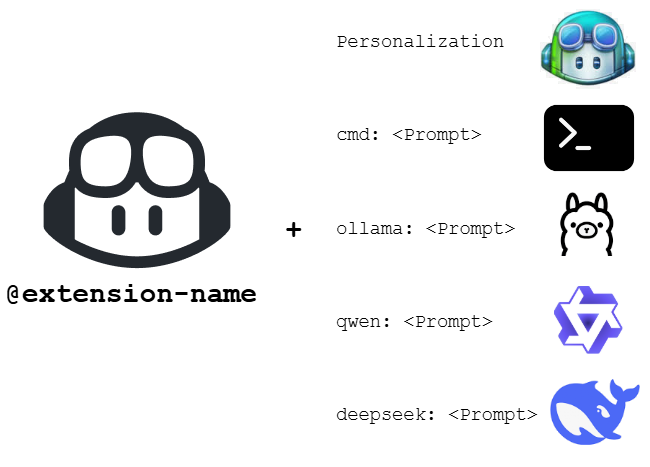
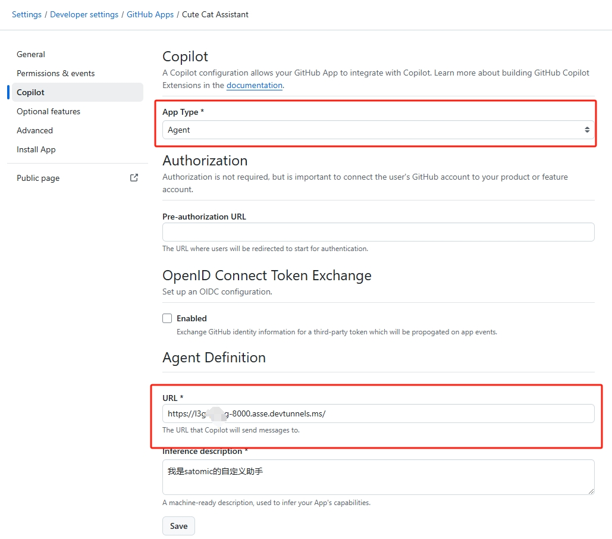
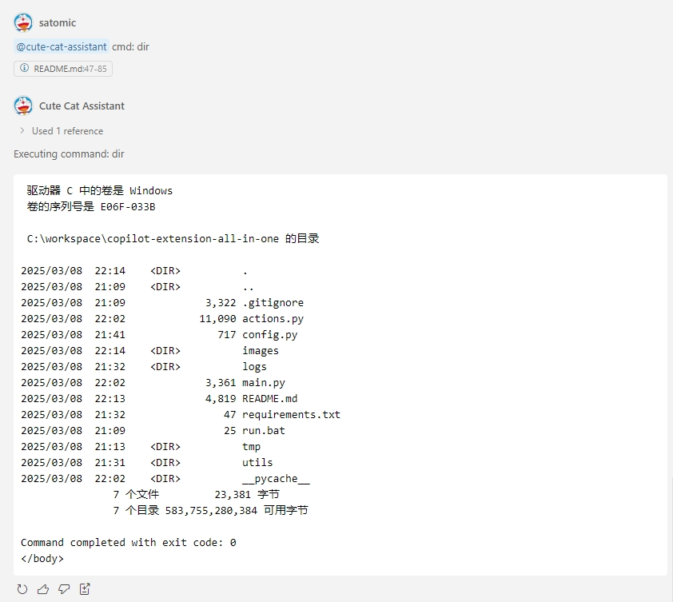
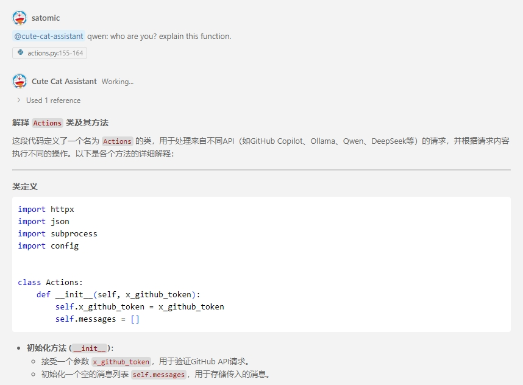
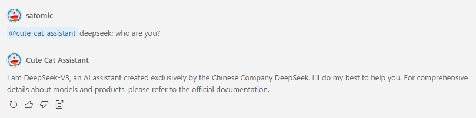

# GitHub Copilot Extensions All in One

This project provides extension capabilities for GitHub Copilot, enabling you to add custom functionalities beyond the standard Copilot features, such as executing command line instructions, interacting with local or third-party AI models, and more.

|**Version**|**Update Notes**|**Date**|
|-|-|-|
|1.0 | ok |20250308|


## Table of contents
- [Features](#features)
- [Installation and Setup](#installation-and-setup)
  - [Prerequisites](#prerequisites)
  - [Installation Steps](#installation-steps)
- [Usage](#usage)
  - [Default Mode (GitHub Copilot)](#default-mode-github-copilot)
  - [Command Execution Mode](#command-execution-mode)
  - [Ollama Mode](#ollama-mode)
  - [Qwen Mode](#qwen-mode)
  - [DeepSeek Mode](#deepseek-mode)
- [Configuration Options](#configuration-options)
- [Advanced Features](#advanced-features)
  - [File References or Selected Content](#file-references-or-selected-content)
  - [Response Streaming](#response-streaming)
- [Frequently Asked Questions](#frequently-asked-questions)
- [Extension Development](#extension-development)


## Features

This extension supports the following key features:

1. **Native GitHub Copilot Support**: Direct interaction with GitHub Copilot for responses
2. **Command Line Execution**: Execute operating system commands using special prefixes
3. **[Ollama Integration](https://ollama.com/)**: Connect to local Ollama models for conversations
4. **[Alibaba Cloud Qwen Integration](https://help.aliyun.com/zh/model-studio/developer-reference/use-qwen-by-calling-api#d059267ec7867)**: Utilize Alibaba Cloud's Qwen AI model
5. **[DeepSeek Integration](https://api-docs.deepseek.com/)**: Access DeepSeek's AI model capabilities




## Installation and Setup

### Prerequisites

GitHub App
- Please refer to [this step](https://github.com/satomic/copilot-funny-extensions/tree/main/skillset-website-updater#create-github-app) to create a GitHub App. Note that the App Type should be **Agent**. After the backend service is started, fill in the URL of the backend service in the Agent Definition of the GitHub App.
   


Backend service.
- Python 3.11 or higher
- Valid GitHub Copilot account and Token
- (Optional) [Local Ollama installation](https://ollama.com/)
- (Optional) Alibaba Cloud Qwen API Key
- (Optional) DeepSeek API Key

### Installation Steps

1. Install required dependencies:

    ```bash
    python -m pip install -r requirements.txt
    ```

2. Configure environment variables (if using Qwen or DeepSeek):
    
    ```bash
    # Linux/MacOS
    export QWEN_API_KEY=your_qwen_api_key_here
    export DEEPSEEK_API_KEY=
    ```

    ```powershell
    # Windows
    $env:QWEN_API_KEY = "your_qwen_api_key_here"
    $env:DEEPSEEK_API_KEY = "your_deepseek_api_key_here"
    ```

3. Start the service:

    ```bash
    # If you are using Windows, you need to configure the Python Scripts path to the path parameter of your system environment variable
    uvicorn main:app --reload
    ```

## Usage

The extension differentiates between features using different command prefixes:

### Default Mode (GitHub Copilot)

Simply input your question to get a response from GitHub Copilot:

```
@extension-name How can I implement a simple HTTP server in Python?
```

### Command Execution Mode

Use the `cmd:` prefix to execute operating system commands:

```
@extension-name cmd: dir
```


### Ollama Mode

Use the `ollama:` prefix to access your local Ollama model:

```
@extension-name ollama: Please explain the basic principles of quantum computing
```

### Qwen Mode

Use the `qwen:` prefix to access the Alibaba Cloud Qwen model:

```
@extension-name qwen: Write a poem about artificial intelligence
```



### DeepSeek Mode

Use the `deepseek:` prefix to access the DeepSeek AI model:

```
@extension-name deepseek: Create a detailed outline for a research paper on climate change
```



## Configuration Options

You can modify the following configurations in the `config.py` file:

- **GitHub Settings**:
  - `VERIFY_GITHUB`: Whether to verify GitHub request signatures
  - `GITHUB_API_URL`: GitHub Copilot API endpoint

- **Ollama Settings**:
  - `OLLAMA_API_URL`: Ollama API endpoint
  - `OLLAMA_MODEL`: Ollama model name to use

- **Qwen Settings**:
  - `QWEN_API_URL`: Qwen API endpoint
  - `QWEN_MODEL`: Qwen model version to use

- **DeepSeek Settings**:
  - `DEEPSEEK_API_URL`: DeepSeek API endpoint
  - `DEEPSEEK_MODEL`: DeepSeek model to use (default is "deepseek-chat")

- **Command Execution Settings**:
  - `CMD_EXECUTOR`: Command line executor (default is `cmd.exe`)

## Advanced Features

### File References or Selected Content

When referencing files or selected code segments in your message, this content is automatically included in the request, enabling AI models to provide more targeted responses based on the context.

### Response Streaming

All models support streaming responses, allowing you to see AI-generated content in real-time.

## Frequently Asked Questions

1. **Q: How do I connect after starting the service?**  
   A: The service starts by default on localhost:8000 and can be accessed via HTTP POST requests.

2. **Q: How do I change the Ollama model?**  
   A: Modify the `OLLAMA_MODEL` parameter in the `config.py` file.

3. **Q: How do I handle API access limitations?**  
   A: For third-party services like Qwen and DeepSeek, make sure to follow their API usage limits and rate requirements.

4. **Q: How do I obtain a DeepSeek API Key?**  
   A: Visit the [DeepSeek API website](https://platform.deepseek.com/) to sign up for an account and obtain an API key.

## Extension Development

To add new AI model integrations, add new handler methods in `actions.py` and register new prefixes in the `prefix_map` in `main.py`.

